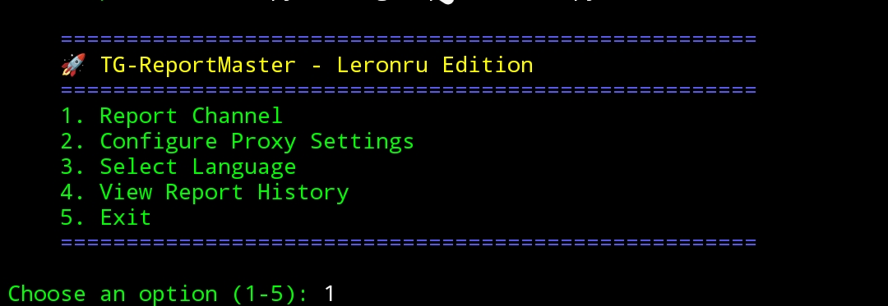

A powerful Telegram spam reporting tool with multi-account support, customizable report reasons, and automated reporting. Features an intelligent delay system to reduce ban risk, ensuring efficiency and safety. Created by Leronru.

TG-ReportMaster

📢 About TG-ReportMaster

TG-ReportMaster is a powerful and user-friendly Telegram spam reporting tool. It supports multiple accounts, customizable report reasons, and an automated reporting system with intelligent delay mechanisms to reduce ban risks. Designed for efficiency and ease of use.

🚀 Features

✅ Multi-account support

✅ Customizable report reasons (spam, abuse, inappropriate content, etc.)

✅ Automated reporting with anti-ban delays

✅ Clean and interactive user interface

✅ Easy setup and usage


📖 Installation & Usage

# Clone the repository
```bash
git clone https://github.com/leronru/TG-ReportMaster
cd TG-ReportMaster
```
# Install dependencies
```bash
pip install -r requirements.txt
```

# Run the tool
```bash
python tg_reportmaster.py
```
## Additional Screenshot


⚠️ Legal Disclaimer

TG-ReportMaster is intended for educational and ethical use only. Misuse of this tool for illegal purposes is strictly prohibited. The developers are not responsible for any misuse, illegal activities, or consequences resulting from the use of this tool.

By using this tool, you agree to comply with all relevant laws and regulations. It is your responsibility to ensure that you have the necessary permissions to report content on Telegram.

📜 License

This project is licensed under the MIT License. See the LICENSE file for details.

📬 Contact & Contributions

Author: leronru

GitHub: leronru

Contributions, issues, and feature requests are welcome!


📌 Copyright & Intellectual Property

TG-ReportMaster and its contents are the intellectual property of Leronru. Unauthorized reproduction or redistribution is prohibited.


# TG-ReportMaster
